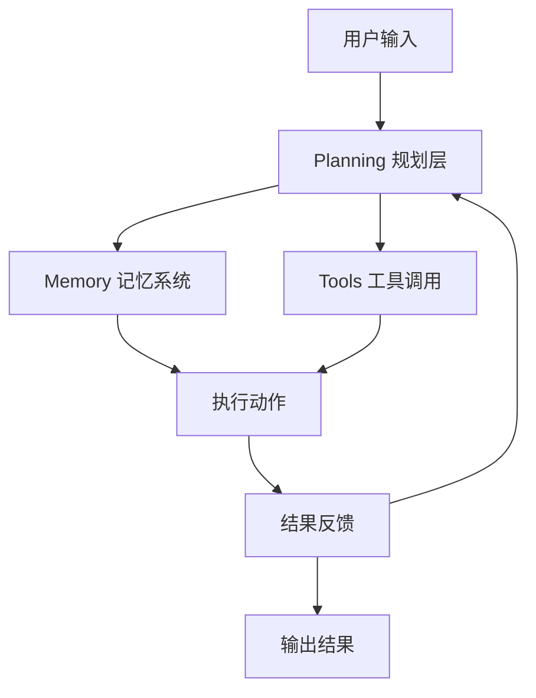

---
# You can also start simply with 'default'
theme: seriph
# random image from a curated Unsplash collection by Anthony
# like them? see https://unsplash.com/collections/94734566/slidev
background: https://images.unsplash.com/photo-1555066931-4365d14bab8c?ixlib=rb-4.0.3&auto=format&fit=crop&w=1920&q=80
# some information about your slides (markdown enabled)
title: AI Coding Agent 完整分享
info: |
  ## AI Coding Agent 完整分享

  从 Chat 到 Agent：AI 编程助手的进化史
  深度解析 Cursor 使用技巧与最佳实践

  演示者：Eric
# apply unocss classes to the current slide
class: text-center
# https://sli.dev/features/drawing
drawings:
  persist: false
# slide transition: https://sli.dev/guide/animations.html#slide-transitions
transition: slide-left
# enable MDC Syntax: https://sli.dev/features/mdc
mdc: true
---

# AI Coding Agent 完整分享

## 从 Chat 到 Agent：编程助手的进化之路

  
    开始分享 <carbon:arrow-right class="inline"/>
  

  <button @click="$slidev.nav.openInEditor()" title="在编辑器中打开" class="text-xl slidev-icon-btn opacity-50 !border-none !hover:text-white">
    <carbon:edit />
  </button>
  <a href="https://cursor.com" target="_blank" alt="Cursor 官网" title="Cursor 官网"
    class="text-xl slidev-icon-btn opacity-50 !border-none !hover:text-white">
    <carbon:code />
  </a>

---
transition: fade-out
---

# AI Coding 进化史 ： 四个阶段演进

| **维度** | **阶段 1: Chat** | **阶段 2: Copilot** | **阶段 3: Agent** | **创造者: Engineer** |
|---------|-----------------|-------------------|------------------|-------------------|
| **核心能力** | 理解自然语言、生成回答、提供信息 | 在特定工作流中提供实时建议与辅助操作 | 自主规划、分解任务、调用工具、达成目标 | 设计、开发、部署和维护 AI 系统及应用 |
| **与用户关系** | 一问一答 (Turn-by-Turn) | 并肩协作 (Side-by-Side) | 授权委托 (Delegate & Forget) | 创造与被创造 |
| **对工具调用** | 有限/不调用 | 集成调用 | 开放式调用 | 开发与集成工具 |
| **典型例子** | ChatGPT、DeepSeek | GitHub Copilot | **Cursor**、Devin | **人类工程师** |

---

# AI Coding 使用状况

<v-click>

### 🕐 现状
目前基本上大部分人都开始使用 **Copilot 模式**来开发。  
相当一部分人开始使用 **Agent 模式**来开发。  
现在流行的 **Vibe Coding**，也是借助于 Code Agent 的能力才能达到。

### 🎯 未来
80% 的人会使用 **Agent 模式**来开发。
人仅仅只作为一个需求提供者和检查者，负责提供任务，让 AI 自主完成。

**古法手工编程** 将会越来越少

</v-click>

---

# Vibe Coding 

  

### 🎨 Vibe Coding 是什么？
Vibe Coding 是一种全新的编程方式，让你可以：
- **自然语言描述**：用日常语言描述你想要的功能
- **AI 自动实现**：AI 理解你的意图并生成代码
- **即时反馈**：实时看到代码变化和效果
- **迭代优化**：持续对话完善功能

 

### 🚀 核心优势
- **降低门槛**：不需要记忆复杂的语法
- **提高效率**：快速原型和迭代
- **专注创意**：把精力放在功能设计而非语法细节
- **学习友好**：通过对话学习编程概念

---

# Cursor 使用概览

三种核心功能各有所长

### Tab 补全
- **使用场景**：快速手动更改
- **优势**：完全控制，快速
- **范围**：单文件

### Cmd K 编辑
- **使用场景**：一个文件中的作用域更改
- **优势**：专注编辑
- **范围**：单文件

### Chat/Agent
- **使用场景**：较大的、多文件的更改
- **优势**：自动收集上下文，深度编辑
- **范围**：上下文密集

<v-click>

### 💡 建议
一般使用默认的 **Agent 模式**即可。但是有时候不希望修改，或者希望与 AI 交流后再修改代码，可以先使用 **Ask 模式**。

</v-click>

---

# Agent/Chat AI 代理详解

四种工作模式

### 1. Agent Mode (代理模式)
- 功能最强大的模式
- AI 可以自主规划并执行一系列复杂的动作
- 浏览文件、创建/编辑代码、运行终端命令等
- 适用于绝大多数场景

### 2. Ask Mode (询问模式 - Beta)
- "只读"模式，用于提问、探索和学习代码库
- 通过 AI 搜索和查询来探索和学习代码库，而无需进行更改
- 默认启用了搜索工具

### 3. Manual Mode (手动模式)
- 提供更精确的控制
- AI 不会自动浏览代码库，严格按照您提供的上下文进行操作
- 当您明确知道要修改哪些文件时使用

### 4. Custom Mode (自定义模式 - Beta)
- 创建符合特定工作流的自定义模式
- 例如：创建"测试生成"模式，专门生成测试用例

---

# 上下文符号系统

## @ 符号的强大功能

### 文件与代码
- **@Files** - 引用项目中的特定文件
- **@Folders** - 引用整个文件夹以提供更广泛的上下文
- **@Code** - 引用代码库中的特定代码片段或符号
- **@Definitions** - 查找符号定义（仅 Cmd K 可用）

### 文档与历史
- **@Docs** - 访问文档和指南
- **@Git** - 访问 git 历史记录和变更
- **@Recent Changes** - 引用最近的代码更改
- **@Past Chats** - 处理总结的 composer 会话

### 工具与配置
- **@Notepads** - 访问笔记
- **@Cursor Rules** - 处理光标规则
- **@Web** - 引用外部网络资源和文档
- **@Link** - 创建指向特定代码或文档的链接
- **@Lint Errors** - 引用 lint 错误（仅 Chat 可用）

### 快捷操作
- **# 文件** - 向上下文中添加文件而不引用
- **/ 命令** - 向上下文中添加打开和活动的文件

---

# Cursor 高级功能

## 提升开发效率的关键特性

### 🤖 AI 生成 Commit Message
- 自动分析代码变更（staged changes）
- 生成总结性的 Commit Message
- 确保提交信息的清晰性和一致性

### 📋 .cursor-rules 文件
- 在项目根目录创建规则文件
- 定义项目特定的 AI 行为规范
- 使用 `/ Generate Cursor Rules` 命令快速生成

### 🔍 自动索引
- 自动索引工作区中的新文件
- 保持代码库上下文为最新
- 未创建索引时会提示创建

### 🚫 .cursorignore 文件
- 类似 .gitignore，控制 AI 访问的文件
- 让每个开发者配置单体仓库中工作的文件夹和路径
- 建议添加到全局 .gitignore

---

# MCP (Model Context Protocol)

### 什么是 MCP？
MCP 允许 Cursor 连接到外部系统和数据源，大大扩展了 AI 的能力范围。

### 实际应用场景
在 Cursor 中，直接向 AI Agent 发出指令：
> **"@MySQL 查询一下 users 表中 id 为 123 的用户的注册时间和状态"**

AI Agent 通过预先配置好的 MCP 工具：
1. 直接连接到您的 MySQL 数据库
2. 执行查询
3. 将查询结果直接返回到聊天窗口中
4. 基于结果继续进行代码生成或修改

### MCP 资源
- **官方推荐**：https://docs.cursor.com/tools
- **第三方 MCP**：可从市场或仓库获取
- **本质**：运行在本地的服务代理

---

# Cursor Beta 实验功能

### 📔 Notepads 笔记本
这是一个可以**跨聊天和代码编辑共享上下文**的强大工具。

**核心功能：**
- 创建持久化的上下文笔记
- 记录项目架构决策
- 存储 API 文档和规范
- 通过 @ 符号在任何地方引用

**特殊优势：**
- **完全由人控制**的区域
- AI 不会自动更新内容
- 适合记录 AI 处理进度
- 跨会话保持一致性

### ☁️ Background Agent 云端代理
更强大的 Agent，可以在**云端执行长时间、复杂的任务**。

**应用场景：**
- 完成一个完整的项目迁移
- 大规模代码重构
- 复杂的多文件同步更新
- 长时间运行的分析任务

**核心优势：**
- **不占用本地资源**
- **任务持续性**：即使关闭编辑器也能继续
- **处理复杂项目**：适合大型重构工作
- **智能任务管理**：自动规划和执行

---

# AI 模型选择策略

## 如何选择合适的 AI 模型

<v-click>

### 🤖 **自动选择策略**
在 Agent 模式下，Cursor 会倾向于自动为您选择最合适的模型，无需手动干预。

</v-click>

<v-click>

### 🔄 **手动切换建议**
当某些模型反复修改都不正确时，可以尝试切换模型：

- **Claude-4-Sonnet**：能应对大部分情况
- **GPT-O3**：用于无法解决的复杂问题
- **GPT-4**：平衡性能和成本的选择

### 📊 **模型特点对比**
- **Claude-4-Sonnet**：代码理解能力强
- **GPT-O3**：推理能力突出
- **GPT-4**：通用性能优秀
- **自动选择**：根据任务特点智能匹配

</v-click>

---

# 个人最佳实践

## 高效使用 Cursor 的核心原则

### 🔄 开发工作流
<v-clicks>

- **与 AI 协作**：使用 Cmd + K, Chat, Agent 等功能与 AI 协作，生成和修改代码
- **审查与采纳**：仔细审查 Cursor 提供的 diff，采纳您认为正确的修改
- **分步提交（Commit）**：将 AI 生成的代码按照逻辑功能点分步提交
- **避免巨大提交**：不要将包含多个功能的修改塞进一个 Commit
- **使用 AI Commit Message**：利用 Cursor 的 AI 生成清晰的提交信息

</v-clicks>

### 🎯 高效使用技巧
<v-clicks>

- **发挥各自优势**：使用 Chat、Cmd K & Tab 发挥它们各自的最佳优势
- **经常创建新聊天**：每次 agent 最多执行 25 个步骤，上下文太长时可能出现问题
- **利用历史聊天**：使用 @Past Chats 引用上一次聊天的汇总
- **先计划后实现**：计划使用询问模式，实现使用代理模式

</v-clicks>

---

# AgenticWorkflows背后原理

Cursor 的各种设置，其实都是在控制 Agent 的 **Tools** 和 **Memory**。但是对于 **Planning** 层，还是难以窥探其方法。

由于 Cursor 的代码闭源，这里使用开源的 Coding Agent：**Cline** 的代码作为参考，来探索 Coding Agent 背后的技术原理。

---

# AgenticWorkflows背后原理

<!-- 使用 onclick 事件实现图片点击放大 -->

  
  
点击图片可放大查看

---

# Coding Agent 产品推荐

## 市场主要产品分析与推荐

<!-- 首选推荐 -->

  

    ⭐ 首选推荐
  

  

    <h3 class="text-xl font-bold text-green-700">Cursor</h3>
    
AI 原生代码编辑器

    

      

        
        完整 AI 集成体验
      

      

        
        独立编辑器，功能强大
      

      

        
        Agent 模式最成熟
      

      

        
        多文件问答与重构
      

    

    

      <strong>适合场景：</strong> 
      新项目开发、大型重构、学习AI编程
    

  

<!-- 平替推荐 -->

  

    🔄 平替选择
  

  

    <h3 class="text-xl font-bold text-blue-700">Trae</h3>
    
阶梯智能 AI 软件工程师

    

      

        
        自主理解需求
      

      

        
        任务自动拆解
      

      

        
        多文件代码生成
      

      

        
        自我修正能力
      

    

    

      <strong>适合场景：</strong> 
      企业级开发、复杂项目规划
    

  

<!-- IDE集成推荐 -->

  

    🔧 IDE集成
  

  

    <h3 class="text-xl font-bold text-purple-700">CodeBuddy</h3>
    
腾讯云 AI 编码助手

    

      

        
        原生IDE集成
      

      

        
        智能代码补全
      

      

        
        团队知识库
      

      

        
        调试辅助功能
      

    

    

      <strong>适合场景：</strong> 
      现有IDE用户、团队协作开发
    

  

---

## 产品对比详细表格

| **产品** | **公司** | **定位** | **核心优势** | **适用场景** | **平台支持** |
|---------|---------|---------|-------------|-------------|-------------|
| **Cursor** 🌟 | Cursor | AI原生编辑器 | 完整AI体验、Agent模式成熟 | 新项目、大型重构 | 独立编辑器 |
| **Trae** 🔄 | 阶梯智能 | AI软件工程师 | 自主规划、任务拆解 | 企业开发、复杂项目 | 平台级产品 |
| **CodeBuddy** 🔧 | 腾讯云 | AI编码助手 | IDE集成、团队协作 | 现有工作流集成 | VS Code、JetBrains |
| Windsurf | Codeium | AI编码平台 | 代码库上下文感知 | 大型代码库 | 多IDE支持 |
| 通义灵码 | 阿里云 | AI编码助手 | 中文优化、企业服务 | 国内企业项目 | VS Code、JetBrains |
| Cline | 开源社区 | AI软件工程师 | 开源免费、可定制 | 学习研究、小型项目 | VS Code |

---

# 实际应用案例

## 真实项目中的使用场景

### 🚀 项目启动
- **快速搭建**：使用 Agent 模式从零创建项目结构
- **依赖管理**：自动配置 package.json 和依赖
- **代码规范**：通过 .cursor-rules 设置项目规范

 

### 🔧 日常开发
- **功能实现**：通过自然语言描述快速实现功能
- **代码重构**：大规模重构时使用 Agent 模式
- **错误修复**：利用 @Lint Errors 快速定位问题

### 🧪 测试与部署
- **测试生成**：使用自定义模式专门生成测试用例
- **文档编写**：@Docs 功能帮助维护项目文档
- **版本管理**：AI 生成的 Commit Message 保持提交历史清晰

 

### 📈 性能优化
- **代码审查**：利用 AI 发现潜在问题
- **性能分析**：结合外部工具通过 MCP 进行深度分析
- **最佳实践**：通过 @Web 获取最新的技术资讯

---

# 总结与建议

### ✅ 核心要点
- **理解进化历程**：从 Chat 到 Agent 的发展脉络
- **掌握工具使用**：Tab、Cmd K、Agent 各有所长
- **建立最佳实践**：分步提交、规范使用、持续优化
- **拥抱技术趋势**：跟上 AI 技术的快速发展

 

### 🎯 行动建议
- **立即开始**：下载 Cursor，开始您的 AI 编程之旅
- **持续学习**：关注官方文档和社区最佳实践
- **分享交流**：与团队分享经验，共同提升效率

### 💡 关键洞察
<v-clicks>

- **AI 不会取代程序员**，但会使用 AI 的程序员会取代不会使用 AI 的程序员
- **工具只是手段**，关键在于如何高效地与 AI 协作
- **保持批判思维**，AI 生成的代码需要仔细审查
- **持续优化工作流**，找到最适合自己的使用模式

</v-clicks>

 

<v-clicks>

### 🚀 未来已来
我们正处在编程革命的起点，让我们一起拥抱这个 AI 驱动的新时代！

</v-clicks>

---
layout: center
class: text-center
---

# Q&A 环节

## 欢迎提问与讨论

🤔

**使用相关**
- Cursor 具体功能
- 最佳实践分享
- 常见问题解决

**技术相关**
- Agent 工作原理
- MCP 集成方案
- 性能优化建议

**应用相关**
- 项目实施经验
- 团队推广策略
- 未来发展讨论

---
layout: center
class: text-center
---

# 感谢聆听！

## 让我们一起拥抱 AI 编程的未来

  
🎉

  
希望这次分享对您有所帮助

  

    
🔗 相关链接

    
<a href="https://cursor.sh" target="_blank">Cursor 官网</a>

    
<a href="https://docs.cursor.com" target="_blank">官方文档</a>

    
<a href="https://github.com/getcursor" target="_blank">GitHub</a>

  

  

    
📚 参考资料

    
Cursor 官方文档

    
Cline 开源项目

    
AI 编程最佳实践

  

  演示文稿使用 <a href="https://sli.dev" target="_blank">Slidev</a> 制作

